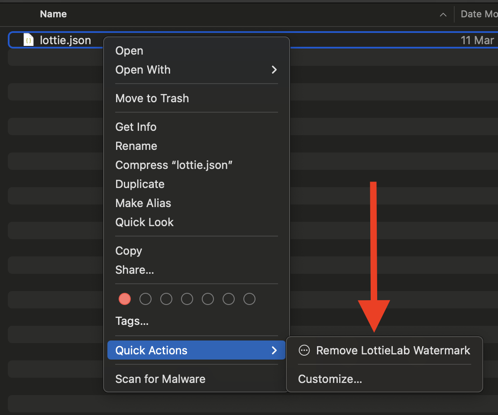
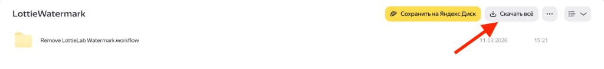
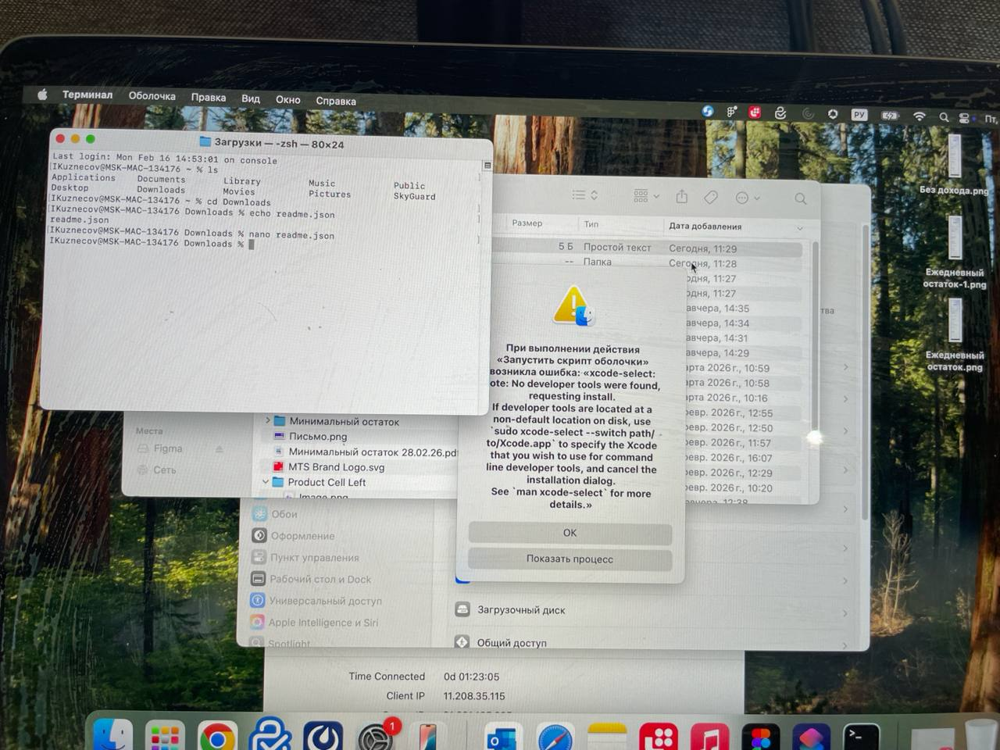

# Удалить LottieLab вотермарку

Удаляет вотермарк LottieLab из Lottie JSON-файлов прямо внутри finder




## Установка на macOS (Quick Action для Finder)

1. Скачай файл **Remove LottieLab Watermark.workflow** с [Яндекс Диска](https://disk.360.yandex.ru/d/dBvfL-fqdiTZLQ)



2. Дважды кликни по скачанному файлу
3. В появившемся диалоге нажми **Install**
4. Готово!

## Как пользоваться

1. Выдели один или несколько `.json` файлов в Finder (через Shift или Cmd)
2. Правый клик → **Quick Actions** → **Remove LottieLab Watermark**
3. Файлы будут очищены от вотермарка

> **Важно:** скрипт перезаписывает файлы. Если нужен оригинал — сделай копию перед запуском.

## Требования и устранение проблем

При первом использовании у вас может появиться следующая ошибка:



Для работы нужен Python 3. На macOS он идёт в комплекте с **Command Line Tools**. Если они ещё не установлены:

1. Открой **Terminal** (Spotlight → `Terminal`)
2. Введи команду:
   ```bash
   xcode-select --install
   ```
3. В появившемся окне нажми **Install**
4. Дождись окончания установки (может занять несколько минут)
